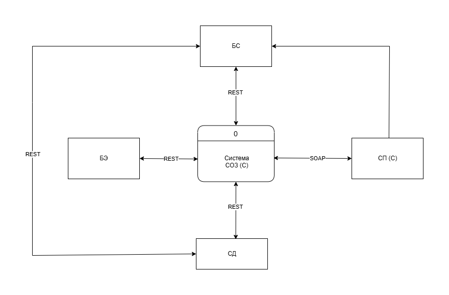

# Введение
## Глоссарий

| Термин | Сокращение | Описание |
|---|---|---|
| Веб-приложение | - | Веб-приложение, через которое клиент осуществляет покупку. |
| Служба обработки заказов | СОЗ(С) | Служба обработки заказов. Система, которая принимает заказы с мобильного приложения и проводит дальнейшую обработку. Является оркестратором процесса. |
| Биллинговая система | БС | Биллинговая система. Система, которая учитывает цену товара в зависимости от количество товаров, скидки по товарам, налоги и выставляет счет для оплаты. |
| Платежная система | БЭ | Платежная система. Система, через которую принимается платеж от клиента. В текущем случае это банк эквайринг. |
| Система продуктов | СП(С) | Система продуктов. Каталог товаров, доступный для выбора клиентам в мобильном приложении. |
| Служба доставки СДЭК | СД | Служба доставки СДЭК. Система, реализующая доставку товаров клиенту по указанному в заказе адресу. |

##  Цель интеграции. Решаемая задача

Цель интеграции: оптимизировать и ускорить все этапы процесса онлайн-продаж, от выбора товара до доставки, за счет автоматического обмена информацией и устранения ручных операций, что приведет к повышению общей эффективности

Задача: спроектировать следующие виды интеграций

* Веб-приложение ↔ СОЗ(С): Прием заказов от клиентов.

* СОЗ(С) ↔ СП(С): Проверка наличия товаров и получение цен.

* СОЗ(С) ↔ БС: Расчет стоимости заказа.

* СОЗ(С) ↔ БЭ: Проведение оплаты.

* СОЗ(С) ↔ СДЭК: Передача данных для расчета доставки.

## Пользовательские требования

| № п/п | Код требования                 | Требование                                                                                                                                                                                                                                                                                                                    |
|-------|--------------------------------|--------------------------------------------------------------------------------------------------------------------------------------------------------------------------------------------------------------------------------------------------------------------------------------------------------------------------------|
| 1.    | СОЗ(С). Создание заказа        | СОЗ(С) должна принимать заказы, оформленные клиентом в мобильном приложении. Система должна фиксировать следующие данные о заказе: идентификатор клиента (полученный из системы авторизации), список товаров с количеством, адрес доставки, и время заказа.                                                     |
| 2.    | БС. Расчет стоимости заказа.   | БС должна рассчитывать общую стоимость заказа, полученного от СОЗ(С), включая стоимость товаров, доставки и учитывать все применимые скидки и налоги.                                                                                                                                                            |
| 3.    | СОЗ(С). Отслеживание заказа.   | Сотрудник компании может просматривать текущий статус обработки заказа в системе СОЗ(С).                                                                                                                                                                                                                            |
| 4.    | СОЗ(С). Уведомление клиента    | СОЗ(С) должна автоматически отправлять уведомления клиенту об изменениях статуса заказа на выбранный канал связи.                                                                                                                                                                                                   |
| 5.    | СД. Уведомление клиента        | СД должна автоматически отправлять клиенту уведомления об изменениях статуса и состояния его посылки через выбранный канал связи.                                                                                                                                                                                        |
| 6.    | БЭ. Проведение оплаты          | БЭ должен обеспечить возможность проведения и подтверждения факта оплаты клиентом, а также автоматическую отправку чека клиенту по электронной почте.                                                                                                                                                             |
| 7.    | СП(С). Проверка наличия товара | СП(С) должна при расчете заказа учитывать наличие товара на складе с учетом актуальной стоимости.                                                                                                                                                                                                                   |
| 8.    | СОЗ(С). Интеграция с СДЭК      | СОЗ(С) передает информацию об оплаченных заказах в СДЭК для организации доставки.                                                                                                                                                                                                                              |
| 9.    | БС. Применение промоакции      | БС учитывает промоакции (включая скидки от объема) при расчете стоимости заказа.                                                                                                                                                                                                                                 |
| 10.   | СД. Отслеживание посылки       | СД должен передавать статус для отслеживания доставки посылки для клиента. (Требуется уточнение деталей:  Какие статусы, как часто, какая информация передается клиенту, через какие каналы связи).                                                                                                        |

## Нефункциональные требования 
| Код требования | Требование                                                                                                                                                               |
|-----------------|--------------------------------------------------------------------------------------------------------------------------------------------------------------------------|
| **Производительность** |                                                                                                                                                                          |
| Производительность. Число пользователей | В период пиковой нагрузки не более 100 000 пользователей.                                                                                                                |
| Производительность. Создание заказа  | Создание заказа в системе не более 1 минуты:   а) Получение данных о товаре из СП(С)   б) Расчет итоговой стоимости заказа из (БС)   в) Расчет доставки из (СД) |
| Производительность. Проведение платежа | Проведение платежей не более 3 минут                                                                                                                                     |
| Производительность. Отправка уведомлений | Отправка не более 3 минут от момента смены статуса.                                                                                                                      |
| **Надежность**     |                                                                                                                                                                          |
| Надежность. Вероятность сбоя          | 2%                                                                                                                                                                       |
| Надежность. Время восстановления после сбоя | не более 5 мин                                                                                                                                                           |
| **Доступность**    |                                                                                                                                                                          |
| Доступность. Допустимое время простоя в час, минут | Система должна демонстрировать уровень доступности 98%, при котором допустимое время простоя:   в час не более 1 мин   в месяц не более 1 часа                     |
| Время предоставления сервиса    | 24/7                                                                                                                                                                     |
| Архивирование информации   | Раз в день                                                                                                                                                               |
| **Безопасность**   |                                                                                                                                                                          |
| Безопасность. Контроль целостности данных в БД | При сбоях проведения транзакции обеспечить откат без потери данных.                                                                                                      |
| Безопасность. Антибот   | Ограничение количества запросов с одного IP адреса к серверу. Не более 300 запросов в минуту с одного IP-адреса. (уточнить)                                              |

# Общее описание интеграции систем

## Контекстная диаграмма DFD (0)
На уровне «чёрного ящика» мы определяем данные, передаваемые между подсистемами. Рассматриваются только внешние свойства потоков данных, внутреннее содержание систем игнорируется.

## Регламент взаимодействия систем
| № | Система-источник | Система-приемник | Передаваемые данные | Полный объем/ изменения | Периодичность обмена/ событие |
|---|---|---|---|---|---|
| 1 | СП(С) | СОЗ(С) | Данные о товарах и ценах | Полный объем | По запросу |
| 2 | СП(С) | СОЗ(С) | Данные о товарах и ценах | Изменения | По событию (изменения в СП (С)) |
| 3 | СОЗ(С) | БС | Состав заказа | Полный объем | По запросу |
| 4 | БС | СП(С) | Цена (ID товара) | Изменения | По запросу |
| 5 | СП(С) | БС | Базовая стоимость товара | Полный объем | По запросу |
| 6 | СД | БС | Данные о зонах и стоимости доставки | Полный объем/изменения | По событию (получен заказ на расчет стоимости доставки) |
| 7 | БС | СОЗ(С) | Итоговая стоимость заказа и доставки | Полный объем | По событию (завершил расчет) |
| 8 | СОЗ(С) | БЭ | Стоимость заказа для оплаты | Полный объем | По запросу |
| 9 | БЭ | СОЗ(С) | Статус оплаты заказа | Полный объем | По событию (оплачено\отказ в оплате) |
| 10 | СОЗ(С) | СД | Данные о заказе и адресе доставки | Полный объем | По событию (оплачен заказ) |
| 11 | СД | СОЗ(С) | Данные о состоянии доставки заказа | Изменения | По событию (заказ передан клиенту) |
| 12 | СОЗ(С) | СП(С) | Данные о количестве купленных товаров | Изменения | По событию (оплата заказа) |

## Требования к журналировании событий получения данных
| Код требования                                                                                         | Требование | Система-источник | Система-приемник |
|--------------------------------------------------------------------------------------------------------|----------------------------------------------------------------------------------------------------------------------------------------------------------------------|-------------------|------------------|
| get_product_data. СП(С)                                                                                | В рамках журналирования должна сохраняться информация о событиях получения данных о товарах и ценах | СП(С) | СОЗ(С)           |
| get_total_order_cost. БС                                                                               |  В рамках журналирования должна сохраняться информация о событиях получения итоговой стоимости заказа и доставки | БС | СОЗ(С)           |
| get_payment_info. БЭ                                                                                   |  В рамках журналирования должна сохраняться информация о событиях получения информации о статусе оплаты заказа | БЭ | СОЗ(С)           |
| update_delivery_status. СД                                                                             | В рамках журналирования должна сохраняться информация о событиях получения информации о статусе доставки заказа | СД | СОЗ(С)           |
| get_delivery_zones. СД                                                                                 | В рамках журналирования должна сохраняться информация о событиях получения данных о зонах и стоимости доставки | СД| БС               |
| update_stock_quantity. СОЗ(С)| В рамках журналирования должна сохраняться информация о событиях получения информации об изменении количества товаров на складе| СОЗ(С) | СПС(С)           |

## Требования к обработке ошибок и протоколированию ошибок

| Код требования                                         | Требование                                                                                                                                                                                                                                                                                |
| ------------------------------------------------------ | ------------------------------------------------------------------------------------------------------------------------------------------------------------------------------------------------------------------------------------------------------------------------------------------ |
| Ошибка авторизации                                      | Система должна фиксировать факт неуспешной авторизации с кодами ошибок и текстовыми сообщениями.                                                                                                                                                                                       |
| Ошибка исполнения сервиса получения данных             | Система должна фиксировать следующие ошибки при вызове методов получения данных:    ● `success` - успешное выполнение метода    ● `timeout` - ошибка исполнения по истечению времени выполнения метода    ● `failed` - ошибка выполнения бизнес-правила    ● `error` - ошибка исполнения по несоответствию справочных данных и\или формата сообщения. |
| Ошибка на стороне внешней системы                      | Система должна фиксировать все ошибки получения ответов с кодами ошибок и текстовыми сообщениями.                                                                                                                                                                                           |
| Ошибка на стороне вызывающей системы                    | Система должна фиксировать все ошибки отправки запросов с параметрами запросов.                                                                                                                                                                                                         |
| Уведомление администратору об ошибках исполнения в статусе error | Система должна иметь возможность отображать сообщения о текущих ошибках исполнения сервиса получения данных в статусе `error` администратору системы в режиме реального времени:    ● Уведомление в логе журнала интеграции с временем ошибки    ● Уведомление по e-mail                                                                              |
| Пользовательское уведомление об ошибках бизнес-правил  | Система должна отображать сообщение об ошибке с типом `failed`.                                                                                                                                                                                                                            |
| Пользовательское уведомление об ошибке получения данных | Система должна отображать сообщение об ошибке обновления данных из внешних систем клиенту в формате “Ошибка получения данных, обратитесь в службу поддержки”.                                                                                                                           |

## Применяемые технологии 

Технологии:
HTTP/REST и HTTP/SOAP 

Инструменты тестирования:
Postman и Swagger 

## Маппинг данных 
| Система-источник **СП(С)**  |    |       | Система-приемник СОЗ       |    |      |
|-----------------------------|-----|--------------------|-------------------------|-----|------------------|
| Объект/атрибут              |     | Тип, значение                  | Объект/атрибут    |  | Тип, значение   |                  |
| Уникальный идентификатор продукта | *   | UID, число         | Идентификатор продукта  | *   | UID, число       |
| Наименование продукта       |     | string(50)         | Наименование продукта    |     | string(50)       |
| Стоимость                   | *   | string(50)         | Стоимость продукта       | *   | string(50)       |
| Количество на складе        |     | Число              | Количество продукта для заказа |     | Число            |
| Параметры                   |     | string(100)        | Параметры продукта       |     | string(100)      |
| Статус                      | *   | [активный, неактивный] | Статус продукта          | *   | [1, 0]           |
